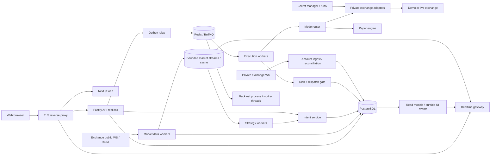

# PHASE 0 — Research and Architecture

Дата исследования: **2026-09-05**. Статус: проект архитектуры для реализации по этапам. Утверждения о биржах подтверждаются ссылками в [исследовании адаптеров](exchange-adapters.md); архитектурные числа ниже являются нашими исходными гипотезами. Проверки счетов и торговые операции не выполнялись.

## Цель и граница первого результата

Платформа объединяет Spot и деривативы Binance, Bybit, OKX и HTX, ручные заявки, стратегии, PAPER, биржевые Demo/Testnet и LIVE. Приоритеты: корректность учёта, отсутствие повторной отправки заявки, защита ключей, восстановление после сбоев. Никаких функций вывода средств. PHASE 0 завершается документацией; bootstrap относится к PHASE 1.

Базовый вертикальный сценарий будущей системы: пользователь входит, создаёт paper-счёт, выбирает инструмент, проверяет стратегию на истории, запускает её на общих рыночных данных, получает сигнал, risk decision, виртуальное исполнение и обновление портфеля. LIVE активируется отдельным серверным разрешением после готовности execution и risk.

## Выбранный стек

| Слой          | Решение                                                         | Причина и ограничение                                                    |
| ------------- | --------------------------------------------------------------- | ------------------------------------------------------------------------ |
| Runtime       | Node.js 24 LTS; точный patch фиксируется в PHASE 1              | Поддерживаемая LTS-линия; сверять security releases перед установкой     |
| Backend       | TypeScript strict, Fastify, Zod, REST `/api/v1`, OpenAPI        | Явные модули, валидация входа и ответа; бизнес-логика не зависит от HTTP |
| Web           | Next.js / React / TypeScript, RU-first, EN resources            | Отдельное web-приложение; server source of truth; HTTP-only session      |
| Storage       | PostgreSQL, Prisma, SQL для hot paths                           | Транзакции, constraints, outbox; TimescaleDB не обязательна              |
| Delivery      | Redis + BullMQ для заданий, ограниченные потоки для market data | Очередь переносит задания; PostgreSQL хранит финансовую истину           |
| Arithmetic    | Decimal.js; decimal strings на сетевых границах                 | Price, quantity, PnL, fees, funding без двоичного float                  |
| Observability | Структурированные логи, OpenTelemetry, метрики и алерты         | Связная торговая трасса и контроль очередей                              |
| Development   | pnpm workspaces, ESLint, Prettier, test runner, Docker Compose  | Точные совместимые версии и лицензии проверяются в PHASE 1               |

Линия Node.js выбрана по [официальному расписанию](https://nodejs.org/en/about/previous-releases). При закреплении Fastify проверить [политику LTS](https://github.com/fastify/fastify/blob/main/docs/Reference/LTS.md). Выбор остальных библиотек — архитектурное решение, а не утверждение об их текущих patch-версиях или отсутствии уязвимостей. До установки: maintenance, advisories, license, размер, совместимость, lockfile и SBOM; exchange SDK оценивается отдельно, скрытые retries недопустимы.

## Топология и границы доверия



Схема показывает логические зависимости, а не SQL CDC: outbox relay читает PostgreSQL; API не публикует финансовое событие независимо от транзакции. На старте это modular monolith с отдельными точками запуска процессов. Общее domain-ядро остаётся библиотекой, workers масштабируются независимо. Next.js не получает биржевые secrets; credentials доступны только изолированным private-connector процессам с workload identity.

## Предлагаемое дерево monorepo

```text
apps/
  api/ web/ market-data-worker/ strategy-worker/
  execution-worker/ background-worker/
packages/
  config/ database/ shared-types/ logger/ ui/
  exchange-core/ exchange-binance/ exchange-bybit/ exchange-okx/ exchange-htx/
  trading-engine/ risk-engine/ strategy-engine/ paper-engine/ backtest-engine/
infra/ docs/ scripts/ tests/
```

Это план; каталоги приложений сейчас не создаются. Domain modules: Users, Authentication, Authorization, Exchange Connections, Market Data, Instrument Registry, Portfolio, Balances, Orders, Trades, Positions, Execution, Risk, Strategies, Backtesting, Paper, Notifications, Audit, Admin, Monitoring, Reporting. Владение таблицами и правила импорта фиксируются в PHASE 1–2; один модуль не меняет финансовые таблицы другого напрямую. Dependency graph направлен от transports к application services, затем к domain и ports; реализации exchange/storage подключаются в composition root.

## Инварианты системы

1. Любая заявка — manual, strategy, TWAP child, rebalance, paper, demo или live — проходит общий Intent → Risk → Execution. Проверки снижения риска отличаются по политике, но также обязательны.
2. Режим, tenant, account, market, environment, instrument version и payload hash связаны с intent. UI не может сменить destination при отправке. Paper-счёт не хранит live credentials.
3. Перед внешним действием существует durable intent и запись единственной попытки отправки. Потеря ответа не означает rejection. Неопределённость блокирует увеличение риска соответствующего scope.
4. At-least-once delivery допускает повтор задания; повтор финансового эффекта подавляется DB constraints, CAS, inbox и reconciliation. Exactly-once между БД и биржей не обещается.
5. Одновременные стратегии учитывают общий риск пользователя и остатки средств, включая pending/unknown orders и reservations.
6. Смена статуса подтверждается допустимым переходом и evidence; snapshot не откатывает уже учтённый fill. Partial fill во время cancel разрешается учётной моделью.
7. Недоступность БД, limiter или подтверждённого состояния блокирует новые dispatch. Даже emergency close требует достоверной позиции и корректной семантики reduce-only/close.
8. Decimal-значения проверяются на масштаб, диапазон и единицы; количество контрактов не приравнивается к количеству базового актива.

## Контракты и данные

[ExchangeAdapter](exchange-adapters.md) нормализует только транспортные и рыночные различия. Его возможности определяются по `(exchange, region, environment, accountMode, market, instrument)`, с состояниями supported/unsupported/unverified. Нативные и синтетические stops имеют разные capabilities.

Общий event envelope: `id`, `schemaVersion`, `eventType`, `correlationId`, `causationId`, UTC `occurredAt` и `receivedAt`, `tenantId` для private events, `strategyRunId?`, `connectionId?`, `instrumentId?`, `source`, `sequence?`, типизированный payload. Public market event не получает фиктивный userId. Финансовые consumer'ы хранят inbox в той же транзакции, что эффект; версии поддерживают rolling upgrade.

Торговая трасса: Signal → OrderIntent → RiskDecision → Order → SubmissionAttempt → clientOrderId / clientAlgoId → exchange order/algo ID → Fill → LedgerEntry → Position. UI показывает понятные статусы; sanitized технические идентификаторы доступны для расследования.

## Strategy, paper и backtest

Strategy API: `initialize`, `onCandle`, `onPortfolioEvent`, `onTimer`, `snapshot`, `restore`; результат — intents и новая версия state. Время и генератор случайности внедряются. Стратегия не обращается к бирже, сети, filesystem или wall clock напрямую. State, входной cursor и signal записываются атомарно; повтор CandleClosed не создаёт новый intent. Warm-up и качество данных проверяются до расчёта.

Builder компилирует schema-validated JSON DSL с AND/OR и allowlist индикаторов: SMA, EMA, RSI, MACD, Bollinger, ATR, ADX, Stochastic, ROC, Volume SMA, Donchian. Ограничивает глубину, число узлов, окна и стоимость. Никакого пользовательского JS, `eval` или небезопасного sandbox. Изоляция ошибок на `(strategyRun, instrument)`; повтор ошибок приводит к pause этого scope, CPU-intensive расчёты идут в ограниченный worker pool.

Каталог PHASE 15: DCA, Grid, EMA crossover, RSI, Bollinger, MACD, Breakout, Trend Following, Trailing, Portfolio Rebalancing, TWAP. У каждой стратегии immutable version, bounds параметров, описание рисков, технические presets, SL/TP policy и отдельные тесты. VWAP откладывается до надёжных данных объёма. Unlimited averaging и обещания доходности исключены.

Paper использует отдельный ledger и реальные public data. Fill model version включает fees, latency, spread/slippage, ликвидность, участие в объёме и partial fills; при отсутствии L2 показывается ограничение модели. Backtest воспроизводит тот же Strategy API, фиксирует dataset/hash, versions, seed, instrument rules и fee schedule. Нет look-ahead: решение на закрытии свечи исполняется не раньше следующего доступного события. Порядок TP/SL внутри OHLC неизвестен — консервативная политика или детальные данные, с отметкой в отчёте. Funding и inverse contracts требуют отдельной модели. In/out-of-sample разделяются; walk-forward — расширение. Метрики учитывают fees/funding; Sharpe/Sortino при недостатке выборки или нулевом знаменателе возвращают unavailable, не Infinity. Equity curve сопровождается качеством данных и ограничениями.

## Web и API

Versioned REST groups: `/auth`, `/users`, `/exchanges`, `/instruments`, `/market`, `/orders`, `/positions`, `/portfolio`, `/strategies`, `/backtests`, `/paper`, `/risk`, `/notifications`, `/audit`, `/admin`. Mutating endpoints принимают runtime schemas, проверяют ownership и idempotency. История использует cursor `(timestamp,id)` и ограниченный page size. Decimal — строка, UTC timestamps — однозначный формат. Ошибка: `{error:{code,message,requestId}}`; stack и raw exchange body не выдаются.

Экраны: Dashboard, Exchange wizard, Terminal, Strategies/Builder, Backtests, Orders/Fills, Positions, Portfolio, Activity, Settings и ограниченный Admin. RU-first strings в ресурсах перевода, доступные подтверждения и подписи режимов; LIVE обозначен текстом «реальные средства», а не только цветом. Search/watchlist/фильтры биржи, рынка, объёма, изменения цены и активных стратегий; тяжёлые списки виртуализируются.

Realtime: авторизованный snapshot с revision → подписка/буфер событий после revision → dedup и обновления. При пробеле cursor — новый snapshot. Reconnect восстанавливает серверное состояние, не localStorage. Cookies, Origin, session expiry/revocation и ownership проверяются также для WS. Медленный клиент получает coalesced ticker; для orders получает resyncRequired, не незаметно пропущенную историю.

Onboarding, glossary, tooltips, объяснение base/quote/contracts, ошибки подключения, live checklist и параметры стратегий — часть PHASE 17. Notifications доставляются через outbox в in-app/email, с dedup и ограничением частоты. Admin имеет health, pause и агрегаты, без расшифровки чужих ключей.

## Масштабирование, надёжность и приёмка

[Market Data](market-data.md) определяет 300 инструментов как 300 уникальных `(exchange, market, symbol)`; 300 на каждой из четырёх бирж — отдельный профиль на 1200. Общие subscriptions обслуживают множество пользователей; private WS растут по числу счетов, это отдельный capacity limit. Стабильные partition keys и epochs защищают от двух владельцев; горячие инструменты можно выделить в отдельные shards.

Bounded queues, rate budgets по общему egress IP и exchange UID, резерв ёмкости для cancel, stop новых сделок при неполноте данных. Тяжёлые backtests не работают в API/market-data loop. План нагрузки содержит 300/600/1200 инструментов, 100 стратегий, reconnect storm и soak; результаты пока отсутствуют.

Подробности: [execution](execution.md), [risk](risk-engine.md), [database](database.md), [security](security.md), [deployment](deployment.md), [ADR](adr/README.md). [План](phase-0/implementation-plan.md) сохраняет PHASE 0–22 и закрывает конфликт ранних live-адаптеров с поздним risk engine. На PHASE 0 остановка после проверки документации; переход к PHASE 1 здесь не выполняется.
