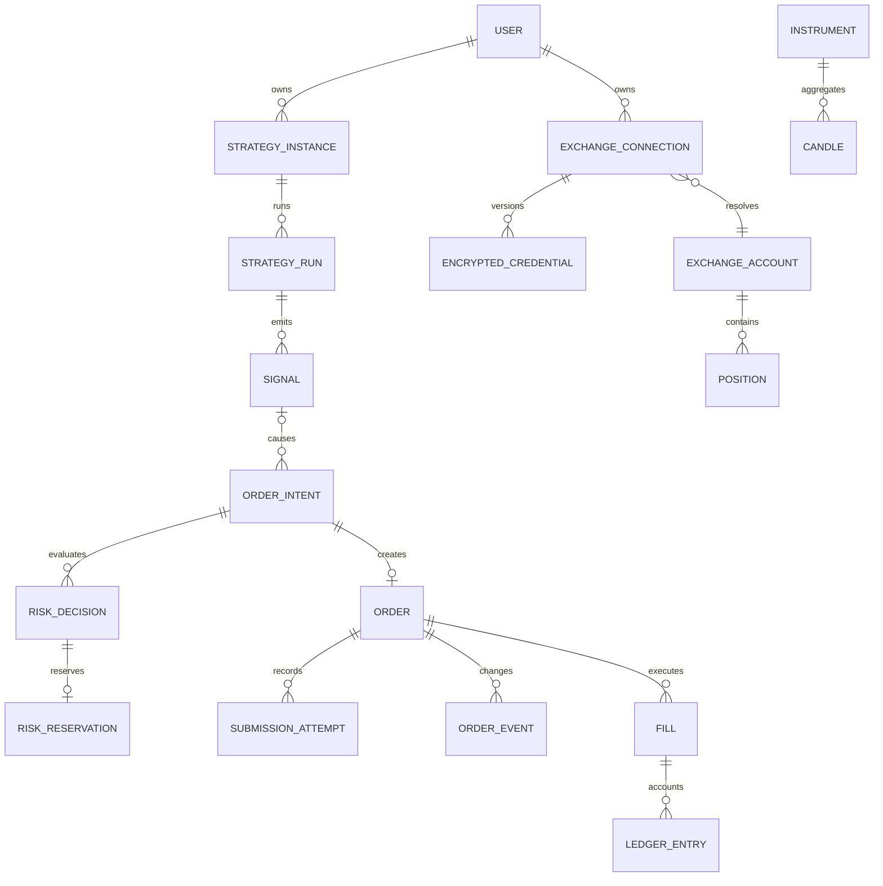

# Database design

PHASE 2 завершена: логическая схема реализована в [Prisma schema](../packages/database/prisma/schema.prisma) и SQL migrations; [команды и роли](phase-2/operations.md), [критерии проверки](phase-2/requirements.md), [результаты локальных проверок и CI](phase-2/verification.md). PostgreSQL — источник истины финансового состояния; Redis cache/queue не заменяет ledger. Tenant соответствует пользователю; организация/несколько членов — возможное расширение с отдельным ADR.

Состояние PHASE 3 на **2026-09-20**: миграция 004 добавляет product-роли USER/ADMIN и ограниченные auth-функции, не меняя опубликованные 001–003. Раздельные `ctp_api` и `ctp_auth` обслуживают tenant-запросы и операции авторизации; password reset/change атомарно отзывают сессии и LIVE grants. Подробности: [граница БД](phase-3/database-security.md), [HTTP-контракт](phase-3/auth-api.md), [запуск и credentials](phase-3/operations.md). Итоговая проверка фазы, включая CI, продолжается; полноценный MFA verifier и account deletion workflow остаются будущими этапами.

## Сущности и владение

| Модуль        | Сущности                                                                                      | Ключевые связи / данные                                                                                                                               |
| ------------- | --------------------------------------------------------------------------------------------- | ----------------------------------------------------------------------------------------------------------------------------------------------------- |
| Users/Auth    | User, UserSession, EmailVerificationToken, PasswordResetToken, TwoFactorConfig, RecoveryCode  | User 1:N sessions; hashes токенов, TTL/revokedAt, encrypted TOTP, consumedAt; account deletion state                                                  |
| Connections   | ExchangeConnection, ExchangeAccount, EncryptedCredential, LiveGrant                           | tenant, exchange UID, region/env/accountMode, status/reconciliation epoch; credential versions + ciphertext/wrapped DEK; LIVE grant связан с версиями |
| Instruments   | Instrument, InstrumentRuleVersion, CapabilitySnapshot                                         | exchange/market/environment/exchangeSymbol, base/quote/settlement, expiry/contract spec; effectiveAt/fetchedAt; immutable historical rules            |
| Accounts      | BalanceSnapshot, Position, AccountStateVersion                                                | account+asset/position side, source/received time, freshness, reconciledAt, net/gross/fees/funding                                                    |
| Accounting    | LedgerTransaction, LedgerEntry, AssetValuation                                                | Immutable per-asset postings, cause fill/funding/adjustment; monetary conservation, conversion provenance                                             |
| Execution     | OrderIntent, IdempotencyRecord, Order, AlgoOrder, SubmissionAttempt, OrderEvent               | immutable command hash, destination/mode, client/exchange IDs, algo-child relation, dispatch evidence, CAS version                                    |
| Trades        | Trade, Fill, Fee, FundingPayment                                                              | Trade — lifecycle/strategy grouping; Fill — биржевое исполнение; market TradeTick отдельно; actual fees и funding                                     |
| Strategies    | StrategyDefinition, StrategyParameter, StrategyInstance, StrategyRun, StrategyState, Signal   | Definition+parameters version immutable; instance owner, selected instruments/watchlist snapshot, mode; run input cursor/version, signal uniqueness   |
| Risk          | RiskProfile, RiskDecision, RiskEvent, RiskReservation, RiskBudget, TradingPause, CircuitState | policies/versions, reservation lifecycle, budget keys, pause scopes/epochs и причины                                                                  |
| Paper         | PaperAccount, PaperOrder, PaperPosition                                                       | Отдельные namespaces/ledger, virtual balance/model version; shared OrderIntent/Order lifecycle с paper extension, без live connection credentials     |
| Backtest      | Backtest, BacktestTrade, BacktestMetric, DatasetManifest                                      | immutable strategy/data/rules/model versions+seed, job state, artifact URI/hash; runs не смешиваются с live portfolio                                 |
| Market        | Candle, MarketGap, MarketCheckpoint, SubscriptionAssignment                                   | Time partitions, source revision/quality, cursor/owner epoch; сырой tick archive вне бессрочной OLTP                                                  |
| Messaging/Ops | OutboxEvent, ConsumerInbox, Notification, AuditLog, SystemEvent, ReconciliationRun            | Event schema version, dedup, delivery attempts, append audit, incident/evidence                                                                       |

PaperOrder — extension общего execution order через `orderId` с уникальной связью, не конкурирующий источник order status. Аналогично PaperPosition задаёт paper account scope; financial writer один. BACKTEST ledger локален run и никогда не меняет balances LIVE/PAPER.

## Типы и constraints

Internal IDs — UUID; внешние IDs — bounded string даже если состоят из цифр. UTC `timestamptz(3)`; cursor содержит timestamp+ID. PHASE 2 хранит деньги как `NUMERIC` без typmod: явные SQL CHECK отклоняют over-scale, overflow и специальные значения до возможного округления. Для price/quantity/amount допустимы 20 целых и 18 дробных цифр, для aggregate — 30 и 18, для rate — 2 и 18. Категория и знак указаны у каждого поля в Prisma schema. `decimalText` проверяет и нормализует строки без арифметики JavaScript number. Промежуточная Decimal precision минимум 80 значащих цифр остаётся требованием будущих расчётных writers; PHASE 2 не выполняет PnL/valuation arithmetic. Contract count — отдельный integer/decimal по подтверждённым instrument rules. Все денежные сущности несут asset/unit, нельзя складывать BTC и USDT без valuation.

| Ограничение                                                                            | Цель                                                                   |
| -------------------------------------------------------------------------------------- | ---------------------------------------------------------------------- |
| `UNIQUE(tenantId, operation, idempotencyKey)` + requestHash                            | Один API intent; conflicting reuse → 409                               |
| `UNIQUE(runId, instrumentId, inputIdentity, ruleVersion, signalKind)`                  | Повтор CandleClosed не создаёт второй signal                           |
| `UNIQUE(intentId)` для Order; `UNIQUE(orderId, operationVersion)` для dispatch attempt | Один order/одно разрешение на конкретную внешнюю mutation              |
| `UNIQUE(exchangeAccountId, environment, clientIdNamespace, clientId)`                  | Не переиспользовать client IDs, учитывать algo namespace               |
| Scoped UNIQUE nullable exchange order ID по account/mode/market/instrument             | Дедуп внешнего ордера, null ещё не присвоенного ID не конфликтует      |
| `UNIQUE(accountId, market, instrumentId, executionIdentity)` для Fill                  | Повтор private/reconciliation payload не начисляет fill дважды         |
| `UNIQUE(consumer, eventId)` в ConsumerInbox                                            | At-least-once delivery, ровно один local effect                        |
| `UNIQUE(accountId, mode, instrumentId, positionSide, positionBucket)`                  | Раздельный NET/LONG/SHORT и margin bucket                              |
| Composite FK `(tenantId, connectionId)` и аналогичные parent-child FK                  | Нельзя связать order пользователя A с connection B                     |
| `CHECK(quantity>0)`, nonnegative cumulative fill, allowed mode/destination             | Базовая целостность; часть связных инвариантов — transactional service |
| Unique current credential version / instrument rule version                            | Атомарная смена версии без двух active records                         |

Размер identity scope Fill определяется отдельно по бирже; нельзя предполагать глобальную уникальность trade/exec ID. Если биржа не даёт стабильный ID, adapter обязан разработать проверяемый composition key; совпадение price/quantity/time само по себе недостаточно.

После PITR нельзя повторно выделять потерянные client IDs из восстановленной sequence. Перед rearm нужен новый непересекающийся namespace/epoch в пределах exchange charset/range и подтверждённая верхняя граница allocation из независимого durable audit/high-watermark. Если это невозможно доказать (особенно numeric HTX IDs), профиль остаётся заблокированным. UUID collisions и numeric rollover также проверяются constraints; смена namespace не разрешает повтор UNKNOWN intent.

Ledger entries группируются транзакцией и активом. В PHASE 2 deferred SQL triggers требуют минимум две entries и точный нулевой итог по каждому активу; header без entries также отклоняется. При commit posting получает внутреннюю seal, позднее добавление entries запрещено, включая конкурентные транзакции и stale snapshots. Прикладной writer с fee/funding/external counteraccounts и correction операциями относится к PHASE 10. Rebate имеет отдельный допустимый отрицательный знак. Corrections append-only, будущие derived balances сверяются с биржей. Удаление User не каскадно удаляет unresolved orders и ledger: workflow pseudonymization/retention policy отдельно.

## Транзакции и конкурентность

Контракт будущих writers: intent+idempotency+outbox; signal+strategy state+cursor+outbox; fill+ledger+position+inbox+outbox; risk decision+reservation+budget — отдельные атомарные операции. PHASE 2 проверяет DB constraints, CAS и rollback primitives; эти бизнес-операции целиком ещё не реализованы. CAS version и locks берутся в стабильном порядке. SELECT SKIP LOCKED допустим для распределения outbox/queue work, но не как обход account risk lock. Не держать SQL transaction во время exchange HTTP/WS.

Не полагаться на read replica для dispatch, balances или pause: replication lag нарушает safety. Read-only history/analytics допускает replica с указанным lag. Pool на каждый процесс ограничен, сумма оставляет headroom для control/reconciliation. Tenant RLS и раздельные роли описаны в [security](security.md). Все schema changes — migrations, не production schema push.

## Индексы и запросы

| Запрос                        | Индекс, реализованный в PHASE 2                                                                                 |
| ----------------------------- | --------------------------------------------------------------------------------------------------------------- |
| История пользователя          | Order `(tenantId, createdAt DESC, id DESC)`                                                                     |
| Active orders по счёту        | `order_active_account (tenantId, accountId, instrumentId, id) WHERE isActive`; connection/status index сохранён |
| Trades/fills                  | Fill `(tenantId, orderId, timestamp, id)` и `(tenantId, instrumentId, timestamp DESC, id DESC)`                 |
| Strategies                    | `strategy_running_tenant (tenantId, id) WHERE isRunning`; общий `(tenantId, status, id)`                        |
| Candle range                  | `(instrumentId, timeframeSeconds, openTime)` и partition pruning по openTime                                    |
| Ready outbox                  | `outbox_ready (availableAt, id) WHERE deliveredAt IS NULL`; tenant/delivery/availableAt index                   |
| Reconciliation                | Order `(connectionId, reconciliationState, updatedAt)`; SubmissionAttempt unresolved partial                    |
| Audit/backtests/notifications | `(tenantId, createdAt DESC, id DESC)`; фильтры с bounded page size                                              |

В PHASE 2 выполнены EXPLAIN ANALYZE/BUFFERS для шести representative запросов, проверка timestamp+UUID keyset при concurrent inserts и partition pruning. `isActive`/`isRunning` — SQL-owned generated columns: параметризованные запросы используют эти predicates для partial indexes под RLS; Prisma enum filter не является эквивалентным планом. Результаты находятся в [отчёте](phase-2/verification.md). Подпись cursor, привязка к tenant/filter, default page size 50 и maximum 200 — контракт будущего HTTP API. Production SLO и расширенные объёмы проверяются в PHASE 20; индексы не добавляются только ради каждой колонки.

## Retention и архив

Начальная policy (предложение): raw realtime buffers — seconds/minutes с явным gap detection; опциональный compressed raw archive 7 дней для расследований/30s repair, если условия market data разрешают. OHLC 30s/1m — 30 дней online, 3m/5m — 90, 15m+ — 1 год; перед удалением сохранять нужные backtest datasets с manifest/hash в object storage. Long-term history не обещается без приобретения/накопления данных.

Candles partition по UTC времени; уникальность включает partition key `openTime`, instrument/timeframe. Revision обновляется через optimistic check и provenance; историческая версия датасета не меняется. PostgreSQL partitioned global uniqueness нельзя предполагать: для финансовой dedup использовать непартиционированный identity registry либо constraints с полной доказанной scope. Финансовые таблицы первоначально не партиционируются без измерений.

Outbox delivered events/inbox можно архивировать только после согласованного replay horizon; удаление inbox раньше возможной redelivery запрещено. Unresolved intent/attempt/reservation/evidence не удаляются TTL. Diagnostic logs проектно 30 дней; audit/ledger срок задаётся commercial/privacy policy до production, с encrypted archive и legal review. Backup retention и restore описаны в [deployment](deployment.md).

## Проверенные и будущие gates

PHASE 2 проверила fresh/upgrade/repeat migrations, reset только созданной runner disposable DB, cross-tenant FK/RLS под непривилегированной runtime role, duplicate identities, mode/decimal/evidence constraints, конкурентные INSERT/CAS/ledger transactions, rollback, seed и query plans. Точный состав и результаты — в [PHASE 2 verification](phase-2/verification.md); критерии — в [requirements](phase-2/requirements.md).

PHASE 3 дополняет этот набор проверками function grants, CSRF/session ownership, token replay/expiry, hash/epoch CAS, ADMIN/MFA fail-closed и отзыва LIVE grants. Проверки связывают HTTP, auth service и существующую tenant-модель; их обязательный объём закреплён в [требованиях PHASE 3](phase-3/requirements.md), подтверждённые локальные результаты — в [database security](phase-3/database-security.md). Наличие реализации и локальных результатов не закрывает оставшуюся итоговую проверку фазы.

PHASE 10–14 и 22 должны проверить бизнес-транзакции ledger/risk/execution, crash/lost exchange или commit response, replay outbox без повторного order/fill, retention/replay horizon, backup restore и совместимость rolling upgrades. Production rollback не означает destructive downgrade: migration history сохраняется, изменения идут через expand/contract и проверенный forward fix. SQL primitives текущей фазы не заменяют эти будущие сценарии.
