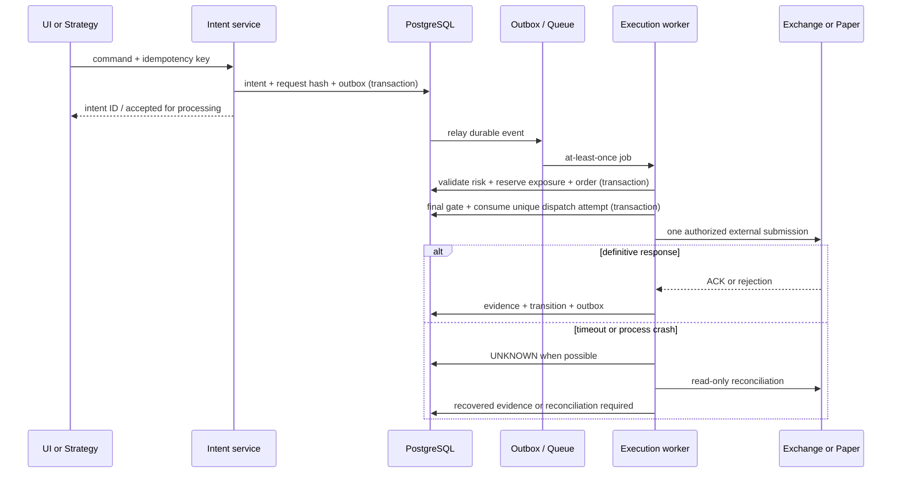
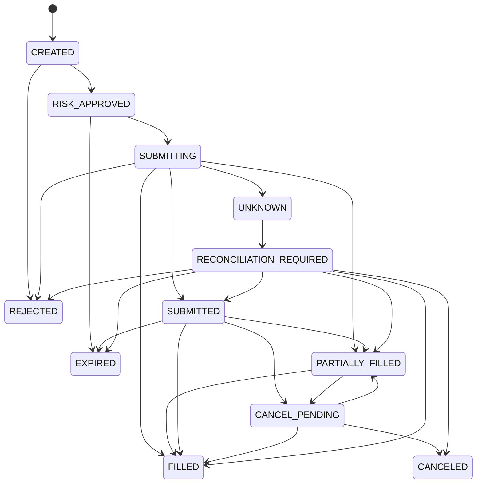

# Execution: durable intent, отправка и reconciliation

PHASE 0 — проект поведения; механизм ещё не реализован. Главный инвариант: повтор HTTP-запроса или queue job не должен создать повторную заявку на бирже. «Exactly once» во внешней системе не обещается.

## Вход и ограничения

Manual, strategy, TWAP slice и rebalance создают `OrderIntent`. В нём immutable owner, execution mode, destination account/profile, instrument/rules version, side/type, size/unit, slippage/price limits, source signal и payload hash. `Idempotency-Key` обязателен для create/start/stop/close; `(tenant, operation, key)` уникален. Повтор с тем же hash возвращает сохранённый result/202; с другим payload — 409. Отсутствие браузерного key у strategy компенсирует deterministic signal identity.

Для внешних client IDs используются заранее сохранённые exchange-compatible значения с DB uniqueness, ограничения длины/charset/числового диапазона задаёт adapter profile. UUID нельзя просто обрезать. HTX numeric ID выделяется persistent sequence в допустимом диапазоне, передаётся строкой; mapping не теряется. Никогда не переиспользовать ID после terminal order/reset. Algo и regular ID spaces различны.

## Последовательность

Ни одна SQL transaction не остаётся открытой во время сетевого запроса. Outbox insert и domain write атомарны; relay можно повторить после crash, consumer inbox исключает второй DB effect. BullMQ stalled/retried job может снова поступить в worker; это ожидается проектом, поэтому queue jobId не служит финансовой защитой. [BullMQ: stalled jobs](https://docs.bullmq.io/guide/jobs/stalled), [idempotent jobs](https://docs.bullmq.io/patterns/idempotent-jobs).

## Dispatch gate и гонка двух workers

1. Risk transaction блокирует account/user risk-budget rows в стабильном порядке, проверяет версии состояния/пауз и создаёт reservation. Решение включает hash нормализованной команды, policyVersion, stateVersion, metadataVersion и expiry.
2. Worker получает rate-budget slot, проверяет deadline и свежесть. Перед отправкой короткая DB transaction повторно проверяет permission/kill epoch, command hash, reservation, state/metadata versions и отсутствие другого dispatch.
3. Atomic CAS `READY → DISPATCHING`, уникальный `SubmissionAttempt(orderId, operationVersion)` и consumed one-shot permit сохраняются **до** первого байта во внешнюю сеть. Право dispatch не восстанавливается только потому, что lease истёк.
4. Worker, проигравший CAS, может только наблюдать/reconcile. Crash после consuming permit, даже до фактической отправки, оставляет ambiguity. Recovery worker не отправляет вместо прежнего worker.
5. Старый worker после pause/partition не должен вызывать transport вне проверенного permit/deadline. Обычный fencing token защищает БД, но биржа не проверяет наш epoch. Поэтому takeover не выдаёт второе право отправки того же intent. Запросы имеют короткое биржевое acceptance window там, где API это позволяет.

Kill switch линейризуется с dispatch gate в БД. Если gate зафиксировался раньше pause, такой in-flight запрос может дойти после нажатия pause; UI показывает in-flight/UNKNOWN и ведёт reconciliation/cancel. Нельзя обещать «после клика физически ни одного пакета». Запрос, чей gate идёт после pause, отклоняется. При отключённом/приостановленном старом процессе оператор сначала гарантирует его завершение и истечение подписанных request windows, затем оценивает внешнее состояние.

При неизвестном результате **повтор placement не разрешается** автоматически, даже если одно чтение возвращает not found. Повтор сетевого действия с гарантированным отсутствием отправки возможен лишь как отдельная явно классифицированная операция до consuming dispatch permit; общий HTTP retry layer для placement выключен. Definitive exchange rejection завершает этот intent; новый пользовательский intent должен пройти risk заново.

## State machine

Для каждой стрелки нужны evidence, permitted previous version и CAS; это не свободный setter. Private fill может прийти до REST ACK — допустим прямой переход из SUBMITTING. Transport ambiguity хранится также отдельным reconciliation state, чтобы не стирать известную filledQuantity. Cancel timeout не забывает факт partial fill; late ACK не откатывает FILLED в SUBMITTED. Пропущенные state transitions восстанавливаются из fills/details, с append-only OrderEvent.

Cancel ACK значит только запрос отмены. CANCELED может иметь filledQuantity>0; финальный ledger включает этот fill, residual reservation освобождается после достаточного evidence. Native algo trigger может породить regular child; terminal algo не означает закрытие позиции. TP/SL siblings и partial fills обрабатываются по semantics биржи, не универсальным «OCO всегда атомарен».

## Reconciliation

Триггеры: restart, timeout, private disconnect, gap, user request, periodic jittered schedule, metadata/account-mode change. Scope включает exchange account+environment+market; для cross margin неизвестность может затронуть весь collateral pool. Mark `RECONCILIATION_REQUIRED`, freeze увеличение риска, сохранить unresolved reservation.

Подписаться/буферизовать private events; читать balances, positions, regular+algo open orders, known-order details, overlapping history и fills с pagination. Сопоставить client IDs и exchange IDs, применить inbox dedup и ledger transactions, затем replay совместимого буфера. Не считать несколько REST snapshots атомарными: использовать source versions, overlap, repeated convergence и watermark evidence. Расхождения регистрируются; старый snapshot не откатывает более новый fill.

Если клиентский ID больше не доступен для lookup, искать exchange ID, history/fills, известные orders и связанные позиции. Окна history ограничены биржей; отсутствие достаточной истории оставляет unresolved state. Нельзя «обнулить» local position или UNKNOWN ради зелёного health. Внешние ручные ордера пользователя импортируются как external-origin и учитываются в risk; исчезновение ордера из open list не доказывает cancel.

Разблокировка — только после проверенного convergence, актуальной цены, правил/permissions, при отсутствии неразрешённых attempts. Возвращение сети не включает LIVE автоматически и не снимает explicit user/global pause. Administrator может поставить pause и приложить evidence, но не переписать fill/history; корректировки accounting отдельными audited entries.

## Тесты до разрешения LIVE

| Failure / edge case                                        | Проверяемый результат                                                                   |
| ---------------------------------------------------------- | --------------------------------------------------------------------------------------- |
| Exchange приняла order, HTTP response потерян              | Ровно один внешний placement в test transport; recovered order/fills, прежний client ID |
| Два workers получили один job                              | Один consumed dispatch attempt; другой только reconcile                                 |
| Crash до/после gate, до/после socket write                 | Не происходит blind takeover dispatch; unknown явно виден                               |
| Lease истёк, старый worker возобновился                    | Новый worker не выдан как второй submitter; late response безопасно применяется         |
| UI двойной click / одинаковый key и разный payload         | Один intent либо 409 без новой заявки                                                   |
| Kill race до и после gate                                  | После pause gate отклоняется; прежний in-flight отслеживается                           |
| Fill до ACK, duplicate fill, cancel/fill race              | Ledger один раз; filledQuantity монотонна, правильный остаток                           |
| DB commit потерял ответ, outbox relay crash, Redis restart | Повтор DB transaction/job не удваивает effects                                          |
| Rate limit/clock skew/5xx                                  | Правильная классификация; no blind retries; бюджет соблюдён                             |
| Истёк client-ID/history retention, not found               | Scope остаётся closed для увеличения риска                                              |
| Paper/Demo payload с live destination                      | Отказ до сети; live signer не вызван                                                    |
| Restart с позиции/ордерами, внешний ручной fill            | Convergence и risk пересчитаны до продолжения                                           |

Эти тесты проектируются для PHASE 4/11/12/19/21 и пока не запускались. Число вызовов test transport и реальные durable rows проверяются вместе; одного mock return value недостаточно.
