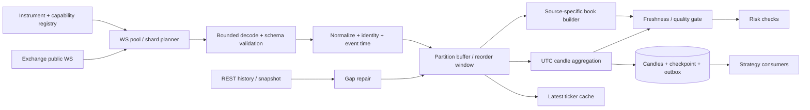

# Market Data: поток, качество и масштабирование

PHASE 0, 2026-09-05. Числа ниже — проектные гипотезы для последующих измерений. Никакой load/soak test на этом этапе не выполнен.

## Requirements и контракты

Общий feed обслуживает всех пользователей по `(exchange, market, environment-of-data, instrument, channel)`. Private streams всегда account-scoped. WS — основной realtime transport; REST — metadata, snapshot, history, recovery и reconciliation. Нет REST polling loop на каждый symbol и нет одного процесса на каждую пару.

Вход: проверенный `TradeTick/Ticker/BookEvent`. Выход: quality-aware `MarketSnapshot`, `CandleClosed`, `CandleRevised`, `MarketDataGap`, `FreshnessChanged`. `SubscriptionRegistry` считает ссылки потребителей; `PartitionOwner` имеет persistent assignment и epoch; `CandleStore` сохраняет revision и input checkpoint. Новый владелец не продолжает старый cursor без восстановления.

## WebSocket lifecycle

States: disconnected → connecting → authenticated (private) → subscribing → synchronizing → healthy; degraded/stale — отдельный результат качества. TCP open, heartbeat и subscribe ACK не доказывают свежесть цены. Отслеживать last frame, last valid event, exchange-time drift, latest trade time, heartbeat roundtrip, pending subscriptions и snapshot completeness.

Планировщик ограничивает connections, topics/request, bytes/request, streams/connection, control messages/s и IP attempts. Эти величины различны на каждой бирже; значения и источники находятся в [exchange research](exchange-adapters.md). Консервативный первоначальный размер shard — 100 инструментов только как настройка проекта, ниже подтверждённого ограничения; ограничение по bytes/sec может потребовать меньший shard. Для Binance разные channel routes — отдельные sockets. Для Bybit 100 Spot topics разбиваются на batches до документированного размера. Для HTX без подтверждённого symbol cap нельзя считать 100 гарантированно рабочими.

Reconnect exponential backoff с full jitter, upper bound и общим IP coordinator. После стабильного периода backoff сбрасывается. Subscription intents сохраняются; ACK коррелируется, отказ не игнорируется. Плановая ротация sockets с lifetime делается с перекрытием и dedup, в пределах общего connection budget. При storm recovery/history имеют bounded parallelism, восстановление идёт волнами, новые стратегии ждут readiness нужного scope.

Snapshot/delta алгоритм задаётся адаптером: подписка/буфер, snapshot с version, отброс покрытых delta, применение совместимых событий. Проверять sequence/checksum только по правилам источника. Нельзя требовать `seq+1` от поля, которое не обещает последовательную нумерацию. Gap, новый snapshot/reset или невозможность упорядочить book → stale, очистка непроверенной книги, resync; таймер сам по себе не делает её healthy.

## Свечи 30s–1h

Для интервала T: `openTime = floor(exchangeEventTime / T) * T`, диапазон полуоткрытый `[openTime, openTime+T)`. Timestamp на правой границе относится к следующему интервалу. UTC, не timezone пользователя. OHLC — по event time с детерминированным tie-breaker trade identity; volume суммируется Decimal с единицами. `receivedAt` используется для latency и freshness, не как замена биржевого времени.

Из trades строятся 30s, 1m, 3m, 5m, 15m, 30m, 1h; допустима агрегация из проверенной меньшей свечи, кратной целевому интервалу. Одну минутную OHLC нельзя разделить на две 30s. Если источник отправляет aggregated trades, адаптер должен подтвердить достаточность их time/price/volume semantics для границ; при невозможности разрешения истории соответствующий timeframe недоступен.

Начальное окно переупорядочивания — 2s, настраивается по измерениям; не доказательство полноты. Watermark основан на времени источника и health evidence; календарное завершение интервала без данных не даёт `complete=true`. При здоровом соединении отсутствие trades отмечается `EMPTY_VERIFIED`, price OHLC остаётся unavailable; UI может нарисовать flat presentation bar с отдельным признаком synthetic, стратегия по умолчанию его не использует. Потеря соединения — `GAP`, а не zero volume.

Identity scope и last processed cursor закреплены за источником. Duplicates не увеличивают объём. Позднее событие до финализации меняет текущую свечу; после финализации создаёт новую revision/CandleRevised и quality incident. Старый live signal не переисполняется задним числом. Стратегии с затронутым state пересчитывают warm-up после pause/recovery; исходные intent/evidence не переписываются. History backfill проходит ту же нормализацию и проверку overlap.

`complete` означает закрытый временной интервал с подтверждённым требуемым качеством потока, а не абсолютную гарантию биржевой истины. Хранятся `quality=VERIFIED|GAP|EMPTY_VERIFIED|LATE_CORRECTION|UNVERIFIABLE`, provenance, dataset revision и полученные repair evidence. Если источник не предоставляет достаточных sequence/history гарантий, это явно снижает quality и разрешённые стратегии.

## Bounded queues и политика перегрузки

| Поток                    | Хранение / предел для первой конфигурации                                                      | Переполнение                                                                                                              |
| ------------------------ | ---------------------------------------------------------------------------------------------- | ------------------------------------------------------------------------------------------------------------------------- |
| Ticker UI                | Last value на instrument, coalesce 250ms                                                       | Заменять промежуточные значения, считать coalesced counter                                                                |
| Trades для свечей        | Bounded ring/Redis stream по partition: максимум 50 000 events или 32 MiB, что наступит раньше | Gap marker, stop затронутых entry-strategies, backfill; не скрывать drops                                                 |
| Book delta               | Snapshot + bounded delta backlog, максимум 16 MiB/partition                                    | Book stale, resnapshot; случайный drop запрещён                                                                           |
| CandleClosed             | PostgreSQL candle+outbox, доставка через очередь                                               | Повтор допустим; inbox/cursor подавляет второй эффект                                                                     |
| Order/fill/private       | DB ingestion + inbox/outbox, ограниченный буфер                                                | При невозможности durable write остановить новые dispatch, mark reconciliation required, восстановить из exchange history |
| Historical/backtest jobs | Ограничение queue age/count и tenant quota                                                     | Reject/defer с понятным ответом, не раздувать RAM                                                                         |

Эти пределы не копируются на каждый из 300 symbols: они заданы на partition/процесс. Ограничить также WebSocket frame, gzip decompressed size, parser depth, indicator window и число consumer'ов. Redis Stream trim может удалить непрочитанное событие — consumer проверяет gap и не считает transport durable ledger. Критические финансовые events не полагаются на Redis retention. Утерянную историю после долгого outage нельзя воссоздать вымышленными fills.

## Capacity model

Единица нагрузки — уникальный exchange-market-instrument, не одинаковый тикер на разных биржах. База: 300 суммарно, 100 активных strategy instances; отдельные варианты: 300 на одной бирже; 300 распределённо на четырёх; 600 stretch; 300 × 4 = 1200 расширенный профиль. Число public subscriptions не умножается на пользователей/таймфреймы; число account-private connections масштабируется отдельно.

Гипотеза: 20 trades/s/instrument в среднем → 6000 trades/s для 300; burst 10× → 60 000/s в течение 30s. При условной serialized event size 250 bytes: 1.5 MB/s и 15 MB/s соответственно, без TLS/JSON/object overhead. Book/ticker traffic добавляется отдельно; не вычитать его из trade budget. Хранение всех этих trades за сутки — около 129.6 GB до индексов/репликации, поэтому бессрочный tick persistence в PostgreSQL исключён.

Свечей на инструмент/сутки: `2880 + 1440 + 480 + 288 + 96 + 48 + 24 = 5256`; на 300 — **1 576 800 rows/day**, около 18.25 rows/s в среднем, но синхронные burst на границе UTC. При условных 250 bytes/row это 394.2 MB/day без indexes/WAL/replicas. Пакетная запись закрытых свечей и time partitions нужны уже на этом масштабе. Retention/rollups описаны в [database](database.md).

Стартовый измерительный стенд: Linux, 8 vCPU, 16 GiB RAM application host; отдельный PostgreSQL 4 vCPU/8 GiB и Redis 2 vCPU/4 GiB, SSD, фиксированная сеть. Это профиль воспроизводимого теста, не рекомендованная production мощность. Отдельно профиль 100 accounts / 100 WS UI clients; 1000 accounts требует нового расчёта private streams и egress quotas.

Цели на стенде: p95 receive→normalized <50ms, p99 <200ms; p99 event-loop lag <50ms; candle dispatch после watermark p99 <1s; CPU sustained <70%; после warm-up RSS не растёт более 5% за последние 4h; backlog после burst убывает до baseline ≤60s. Это исходные acceptance targets, уточняемые по профилю, а не наблюдённые результаты. Exchange network latency измеряется отдельно и не приписывается локальному processing.

## Проверки PHASE 9/20

Unit/property: UTC boundaries всех семи TF, decimal volume, duplicates, permutations, equal timestamps, late correction, gap, empty verified, restart checkpoint. Свойства: high≥open/close≥low; объём unique trades сохраняется; перестановка в допустимом окне даёт тот же результат; aggregation T→kT совпадает при одинаковой provenance/quality.

Integration: recorded/mock WS с явной маркировкой, snapshot+delta/gzip/schema, disconnect/reconnect, lost trades, partition reassignment, Redis trim, DB backpressure, exchange clock skew, delisting, metadata refresh. Input recorder должен отличать fixture от реальной биржи.

Load: 300/600/1200 keys, 4 exchanges, 7 TF, 100 strategies, hot-symbol burst, reconnect storm, slow UI и отдельный private account fanout. Нормальный режим: zero unexplained drops, complete candles и correct signal dedup. Перегрузка: каждый gap виден, stale data не проходит risk, очередь и память ограничены. Soak ≥24h. Отчёт сохраняет commit/config/hardware, dataset/seed, msgs/s, CPU/RSS, event-loop lag, queue depth/age, DB latency, p50/p95/p99, drops/coalesces/gaps/repaired counts. До такого отчёта формулировка «поддерживает 300 пар» запрещена.
